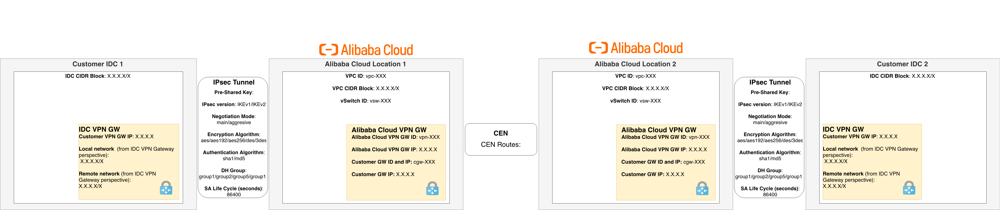
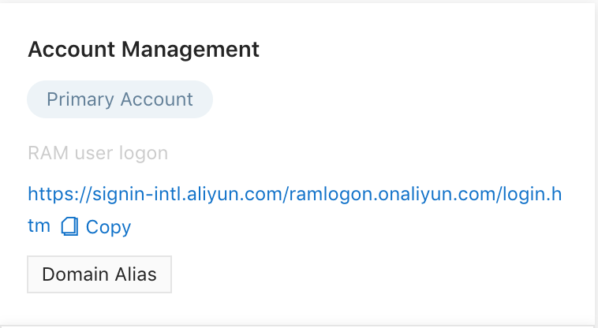
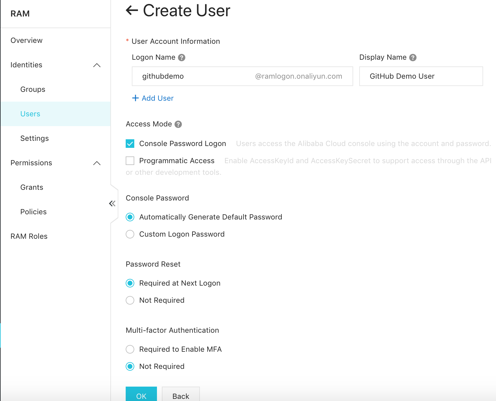

# Alibaba Cloud VPN Gateway & Cloud Enterprise Network Configuration and Troubleshooting

This repository was created to help you with easy Virtual Private Network and Cloud Enterprise Network configuration and troubleshooting.

Table of Contents
=================

   * [Troubleshooting](#troubleshooting)
      * [Hint 1 - check your IDC VPN capabilities](#hint-1)
      * [Hint 2 - check your configuration](#hint-2)
      * [Hint 3 - create a network topology diagram](#hint-3)
      * [Hint 4 - triple check local and remote networks from both IDC and Alibaba Cloud perspective](#hint-4)
      * [Hint 5 - add correct networks to route table](#hint-5)
      * [Hint 6 - create a Read Only User for troubleshooting](#hint-5)

## Troubleshooting

### Hint 1 - check your IDC VPN capabilities

One of the most important things to consider is the IKE version your local devices support.

It is important because IKEv1 has many limitation in comparison to IKEv2.

The most critical one is the ability to add/insert more than one **local and remote network**. I've seen many customers having the necessity to include more than one local network and it wasn't possible due to the local IDC hardware limitation.

### Hint 2 - check your configuration

Before troubleshooting and configuration it is recommended to fill in the https://github.com/wojciehm/Alibaba-Cloud-VPN-Configuration-and-Troubleshooting/blob/master/environment-details.md file.

Once you have the environment details it could be used for configuration and troubleshooting.

### Hint 3 - create a network topology diagram

The second step which helps many customers I worked with is to use the draw.io diagram I created and fill it in with all possible data. This step is crucial to confirm that everything is configured.

Link to the file https://github.com/wojciehm/Alibaba-Cloud-VPN-Configuration-and-Troubleshooting/blob/master/files/VPN-Diagram.xml

### Hint 4 - triple check local and remote networks from both IDC and Alibaba Cloud perspective

Use the environment details as a checkup for any mistakes in local and remote networks.

Many customers make errors in those. Try to understand what is local network from your IDC perspective and Alibaba Cloud VPN Gateway perspective.

### Hint 5 - add correct networks to route table

Routing, especially when combined with VPN Gateways in IDC-to-IDC configuration might be tricky.

When configuring or to be precise advertising networks in **CEN** it is important to include all necessary networks.

#### Example Network CIDR ranges

##### IDC Location 1

Local network segment: 10.0.10.0/24

##### Alibaba Cloud Location 1
Local network segment: 172.16.10.0/24

##### Alibaba Cloud Location 2

Local network segment: 172.16.20.0/24

##### IDC Location 2

Local network segment: 10.0.20.0/24

#### Properly configured routing in CEN

In addition to already created routes we should publish in CEN:
- Alibaba Cloud **Location 1 VPC** advertise network from **customer IDC 1**: 
10.0.10.0/24 with destination Alibaba Cloud Location 2 VPC
- Any other **IDC 1 network if IKEv2** is used
- Alibaba Cloud **Location 2 VPC** advertise network from **customer IDC 2**: 
10.0.20.0/24 with destination Alibaba Cloud Location 1 VPC
- Any other **IDC 2 network if IKEv2** is used

### Hint 6 - create a Read Only User for troubleshooting

In case you need to troubleshoot the VPN&CEN configuration you can create an additional Resource Access Management (RAM) user with **Read Only Policy**.

1. Login to Alibaba Cloud console.
2. Click on **Home** to see all Alibaba Cloud Services.
3. Under Services, select **Resource Access Management** (RAM).

4. If you never used the RAM service, you will be asked to activate it.
5. Once activated you are now on the Dashboard page.

6. Copy the RAM Login Link.

7. Navigate to **Users**.
8. Click **Create User**.
9. At **Logon Name** and **Display Name** enter **Alibaba_Support_Read-Only** (or any username as you wish), **uncheck** the box **Programmatic Access** and check **Console Password Logon**. 
You can automatically generate password or force user to change the password when logging next time and enable or disable Multi Facto Authentication (MFA).

10. User was created.

11. Select user and click **Add Permissions**.
12. Search for the System Policy with name **ReadOnlyAccess** and click ok.

13. User can now login.
